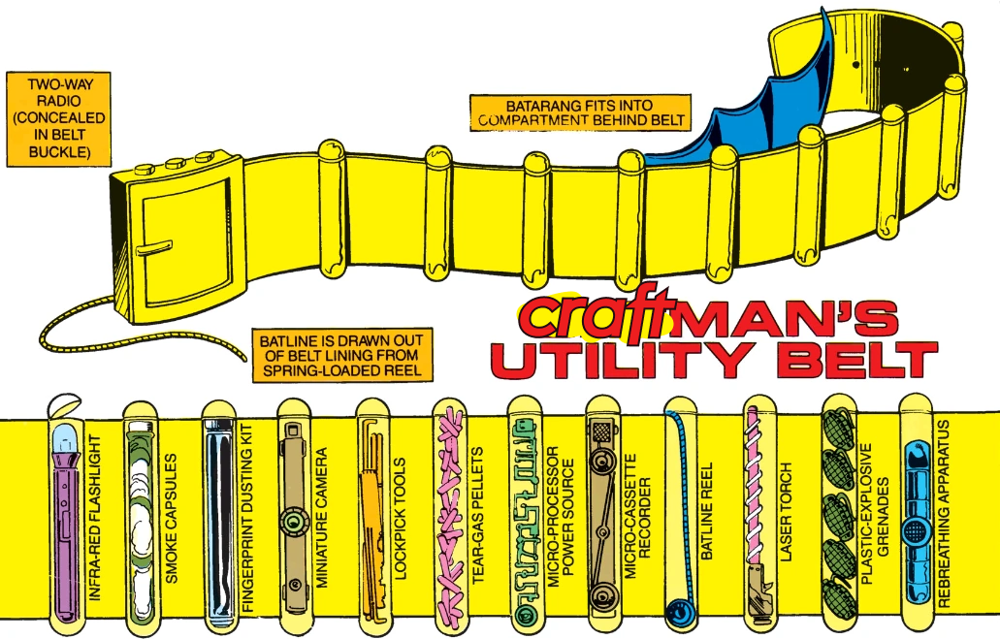

# 🛠 Utility Belt
A collection of things we use on every Craft CMS site

## Features

### SEO

Automatically installs [ether/seo](https://github.com/ether/seo) and creates a default SEO field.

### Logs

Automatically installs [ether/logs](https://github.com/ether/logs).

### Live Preview

Locks the default live preview target to the `api/preview` Next JS endpoint. 
Requires the `FRONTEND_URL` env var.

### Revalidator

Adds dynamic Next JS revalidation support. Uses the section URI and any
additionally defined revalidate URI's (see a Section settings in Craft CP).  
Calls the `api/revalidate` Next JS endpoint.

Requires the `FRONTEND_URL` env var.  
Requires the `REVALIDATE_TOKEN` env var, that must match the token on the frontend.

### Internal URLs

Converts any absolute internal urls (based off `href^=@web`) to relative URIs.

### Inline SVGs

Assets with the `.svg` extension will return the contents of the SVG in the `svg` field on the asset in GraphQL.

### Twig Dashboard Widget

A new dashboard widget that renders the given twig template.

### Link Field
A simple but powerful link field for creating links to internal elements, external URLs, custom URI's or emails.

## Environment Variables

```dotenv
FRONTEND_URL=http://localhost:3000
REVALIDATE_TOKEN=unique-secret-token-shared-with-frontend
```
